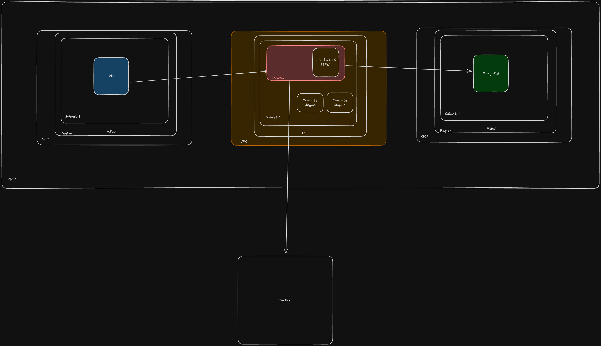

# MongoDB POC

## Steps

See [step-by-step guide](./STEPS.md) on how to deploy this POC to GCP.

## API

```sh
# Set the base URL
export API_URL=http://localhost:8080

# Healthz check without DB connection
curl -v $API_URL/health

# Healthz check with DB connection
curl -v $API_URL/health/db

# Get current value
curl $API_URL/value

# Increment counter
curl -X POST $API_URL/increment

# Clear counter
curl -X DELETE $API_URL/clear
```

## Environment variables

```env
PORT=8080
MONGODB_URI=""
```

## Diagram


